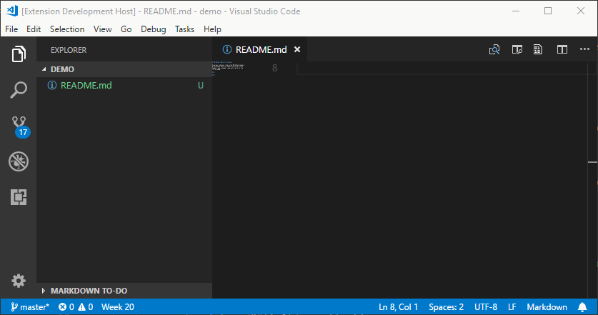

# MarkDown Table of Contents

**OBSOLETE: This extension is now obsolete, use the VS Code breadcrumbs functionality introduced in VS Code 1.26!**

Displays CodeLens items atop MarkDown headers providing a back to top action on non-title headers and a header jump quick pick on the title header.

